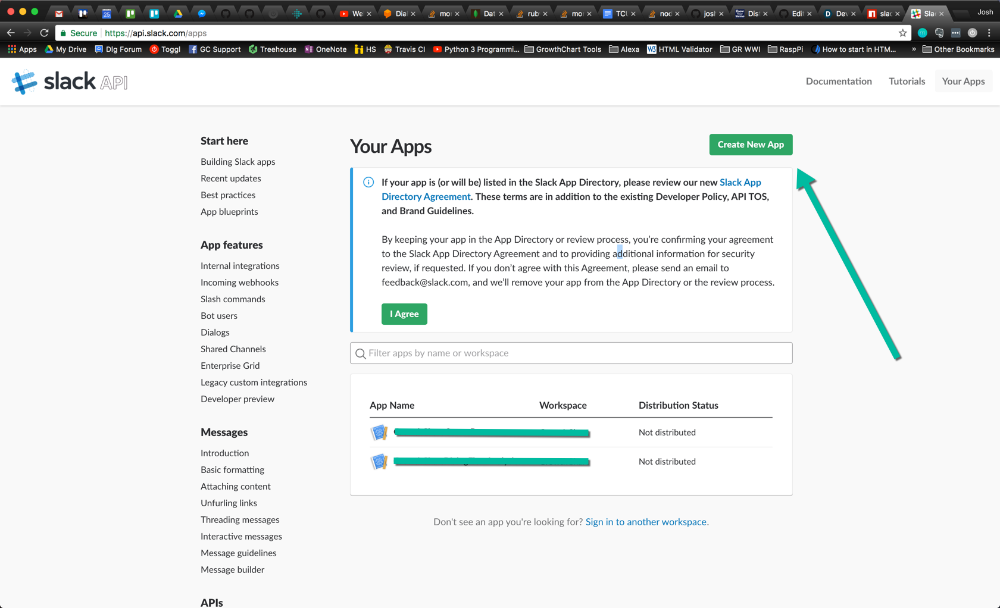
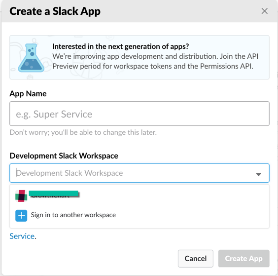
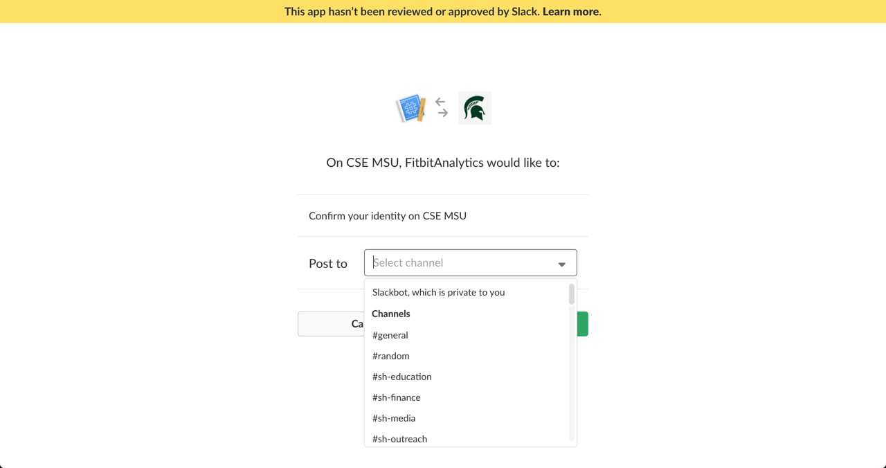
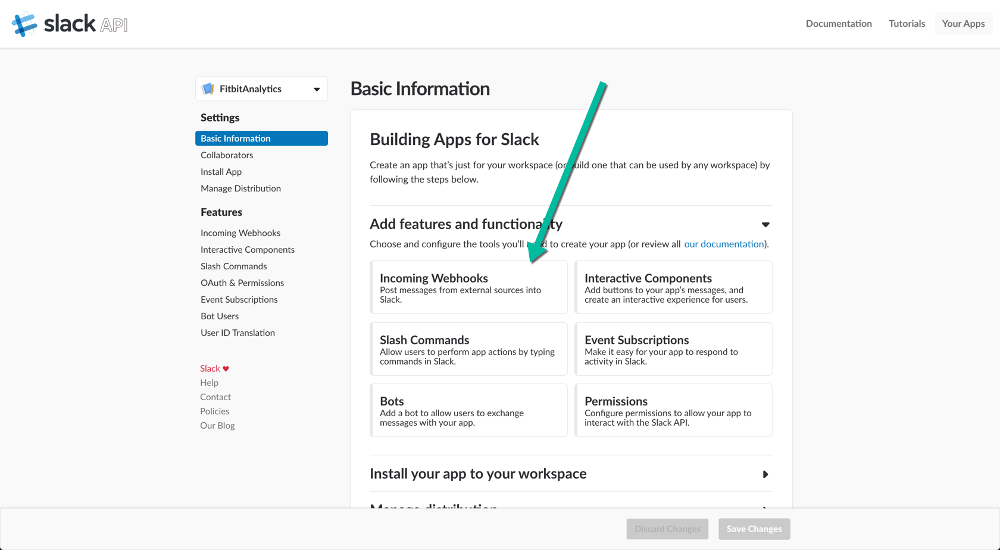
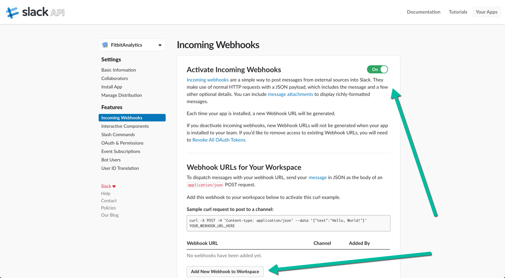

# SlackFlow
DialogFlow Analytics + Slack bot

## Purpose
To make it incredibly simple to have a slack bot grab your Dialogflow's analytics data and give you a daily update on how it's performing

## How it's built
We created and used [Flowlytics](https://github.com/joshbenner851/Flowlytics) library to wrap the Dialogflow Analytics API so all you need to do is provide your headers and slack tokens

## Installation
Run in your terminal
```
npm install --save slackflow
```

## Grabbing Your Dialogflow Tokens
1) To see how to grab your tokens for Dialogflow, see the guide at [Flowlytics](https://github.com/joshbenner851/Flowlytics#grabbing-your-tokens)

## Grabbing Your Slack Tokens
1) To grab your Slack tokens, you have a couple options depending on if you want to post into a DM or a public or private slack channel.
2) First create your [Slack App](https://api.slack.com/apps) by clicking the button in the top right to create

3) Fill out your app's name and the Slack workspace you'd like to use it in

4) You'll have to approve the slack workspace you're adding it to and then choose the user or channel you'd like it to post to

5) For now, this slack app is only a webhook but if someone wants to add slash commands or events that would be awesome

6) Turn on the webhook and grab your webhook URL

7) Copy that webhook URL and drop it into the config file, analytics


## Usage
To configure the library, drop your slack webhook URL's and your tokens from [flowlytics](https://github.com/joshbenner851/Flowlytics#grabbing-your-tokens) down below.

The one thing to note is the `channelsInterval` which is where you configure the places the slack bot will post to, as well as the number of days of data of Dialogflow data you'll be grabbing to post into slack
```
analytics.js

// Array of days and slack channel URLs to post into
const channelsInterval = [
    {
        channelUrl: "https://hooks.slack.com/services/YOUR/SLACK/WEBHOOK_URL",
        day: 1
    },
    {
        channelUrl: "https://hooks.slack.com/services/YOUR/SLACK/WEBHOOK_URL",
        day: 7
    },
    {
        channelUrl: "https://hooks.slack.com/services/YOUR/SLACK/WEBHOOK_URL",
        day: 30
    },
    //etc
];

// Tokens for grabbing Dialogflow Analytics data
const tokens = {
    "xsrf": "YOUR_XSRF_TOKEN",
    "user_agent": "YOUR_USER_AGENT",
    "cookie": "YOUR_COOKIE_HERE",
    // Make sure this starts with 'Bearer'
    "auth": "YOUR_AUTH_TOKEN",
};

require( "slackflow" )( channelsInterval, "YOUR_APP_NAME", tokens );
```

## Crontab
If you want to run this script on a schedule, say every morning at 8am, you'll want to use crontab to execute the analytics.js file
```
crontab -e
```

Example of running the script everyday at 7am
```
* 7 * * * node /var/www/html/scripts/slackflow/analytics.js
```

## Contributors
Built by Josh Benner @ [HackIllinois2018](hackillinois.org). Feel free to make suggestions and pull requests to improve the project.

## License
This project is licensed under the terms of the MIT license.


